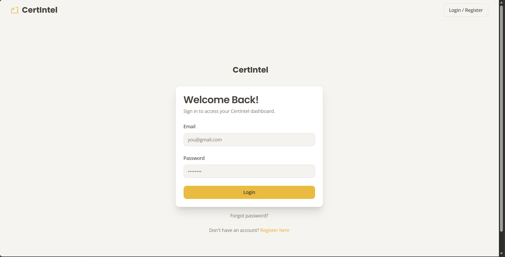
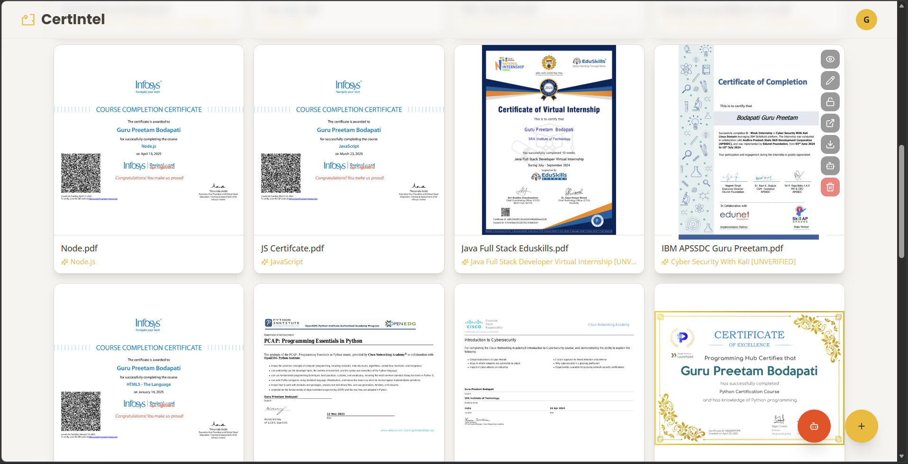
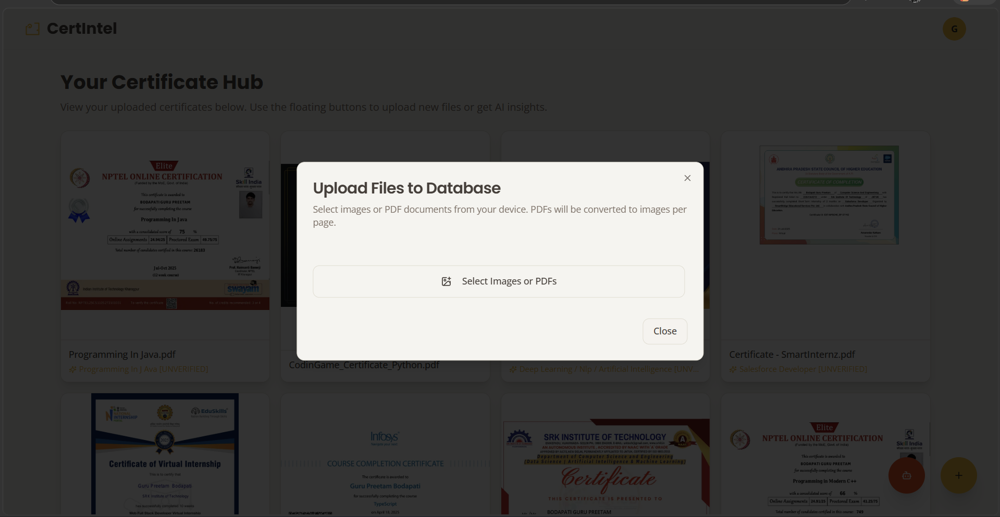
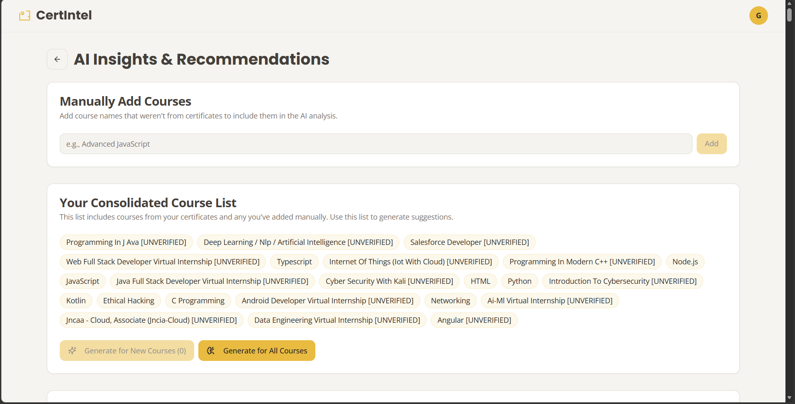
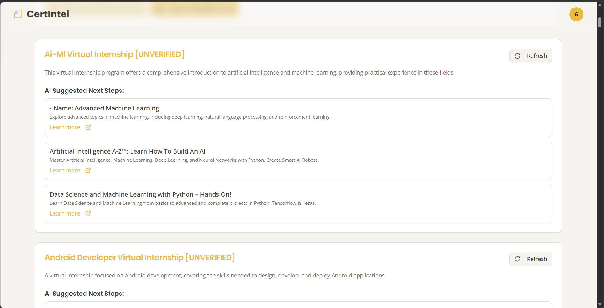

# 🎓 CertIntel

<div align="center">

**An AI-powered certificate management and intelligence platform for students and educators.**

[](https://cert-intel.vercel.app)
[](./LICENSE)
[](https://nextjs.org/)
[](https://www.typescriptlang.org/)
[](https://huggingface.co/spaces/GuruPreetam/CertIntel-Flask-Server)

</div>

---

## 📖 Overview

**CertIntel** is a full-stack web application that helps students upload, organize, and analyze their certificates and course credentials. It features AI-powered OCR to extract certificate data, role-based access for students and admins/teachers, a student–admin linking workflow, and automated email notifications — all in a polished, responsive UI.

---
 
## 📸 Screenshots
 
<div align="center">
  <table>
    <tr>
      <td align="center"><br/><sub>Login Screen</sub></td>
      <td align="center"><br/><sub>Student Home — Certificate Grid</sub></td>
    </tr>
    <tr>
      <td align="center"><br/><sub>PDF Upload Popup</sub></td>
      <td align="center"><br/><sub>AI Course Recommendations</sub></td>
    </tr>
    <tr>
      <td align="center"><br/><sub>AI Recommendations (continued)</sub></td>
      <td align="center"><br/><sub>Admin Dashboard</sub></td>
    </tr>
  </table>
</div>

---

## ✨ Features

### 🔐 Authentication & Roles
- Multi-step registration with **email OTP verification**
- Role-based access: **Student** and **Admin/Teacher**
- Login, logout, and password reset flows

### 👩‍🎓 Student Experience
- Upload certificates as **images or PDFs** (PDFs auto-converted page-by-page)
- View all uploaded certificates in a grid layout
- Request to link with an admin using their unique shareable ID
- Receive email notifications on link request approval or rejection

### 🧑‍💼 Admin Dashboard
- View and manage **pending student link requests** with real-time updates
- Accept or reject link requests
- Browse linked students' certificate collections

### 🤖 AI Integration
- **Certificate OCR** powered by the [CertIntel Flask Server](https://huggingface.co/spaces/GuruPreetam/CertIntel-Flask-Server) hosted on Hugging Face Spaces
- **Course suggestions** powered by AI analysis of certificate content
- **Genkit AI flows** for email OTP, registration, and image processing

### 📧 Email Notifications
- OTP emails during registration
- Registration confirmation
- Student notifications on admin link request outcomes

### 🎨 UI & Design
- Built with **Tailwind CSS** and **ShadCN UI**
- Custom theme: Gold, Light Beige, and Vivid Orange
- Fonts: *Poppins* (headlines) · *Open Sans* (body)
- Fully responsive across device sizes

---

## 🛠️ Tech Stack

| Layer | Technology |
|---|---|
| **Frontend** | Next.js 15, React 18, TypeScript, Tailwind CSS, ShadCN UI |
| **Backend** | Next.js API Routes, Firebase Admin SDK |
| **AI / OCR** | Python Flask ([Hugging Face Space](https://huggingface.co/spaces/GuruPreetam/CertIntel-Flask-Server)), Tesseract.js, Google Genkit, Cohere AI |
| **Database** | MongoDB (GridFS for file storage), Firebase Firestore |
| **Auth** | Firebase Authentication |
| **Storage** | Firebase Storage, MongoDB GridFS |
| **Email** | Nodemailer (Gmail) |
| **Deployment** | Vercel (Next.js), Firebase App Hosting, Hugging Face Spaces (Flask) |

---

## 🚀 Getting Started

### Prerequisites

- **Node.js** v18 or later
- **npm**, **yarn**, or **pnpm**
- A **Firebase** project with Auth, Firestore, and Storage enabled
- A **MongoDB** cluster (local or Atlas)

> **Flask AI Server:** The OCR and AI suggestion backend is hosted on Hugging Face Spaces — no local Python setup required. Just point `NEXT_PUBLIC_FLASK_SERVER_URL` at the Space URL. See the [CertIntel Flask Server Space](https://huggingface.co/spaces/GuruPreetam/CertIntel-Flask-Server) for details.

---

### 1. Clone the Repository

```bash
git clone https://github.com/gurupreetam9/CertIntel.git
cd CertIntel
```

### 2. Set Up Environment Variables

Copy the example env file and fill in your credentials:

```bash
cp .env .env.local
# or
cp .env.example .env.local
```

Open `.env.local` and fill in:

```env
# Firebase (Client)
NEXT_PUBLIC_FIREBASE_API_KEY=
NEXT_PUBLIC_FIREBASE_AUTH_DOMAIN=
NEXT_PUBLIC_FIREBASE_PROJECT_ID=
NEXT_PUBLIC_FIREBASE_STORAGE_BUCKET=
NEXT_PUBLIC_FIREBASE_MESSAGING_SENDER_ID=
NEXT_PUBLIC_FIREBASE_APP_ID=
NEXT_PUBLIC_FIREBASE_MEASUREMENT_ID=        # Optional

# Firebase (Admin SDK)
GOOGLE_APPLICATION_CREDENTIALS=            # Path to your service account JSON

# MongoDB
MONGODB_URI=
MONGODB_DB_NAME=certintel_db

# Flask AI Server (hosted on Hugging Face Spaces)
NEXT_PUBLIC_FLASK_SERVER_URL=https://gurupreetam-certintel-flask-server.hf.space

# Email (Gmail)
GMAIL_EMAIL_ADDRESS=
GMAIL_APP_PASSWORD=
```

> **Tip on `GOOGLE_APPLICATION_CREDENTIALS`:** For local development, set this to the absolute path of your Firebase service account JSON file. In Firebase App Hosting or GCP environments, Application Default Credentials are used automatically.

---

### 3. Install Node Dependencies

```bash
npm install
# or
yarn install
# or
pnpm install
```

### 4. Run the Development Servers

**Next.js frontend** (runs on port 9005):
```bash
npm run dev
```

**Genkit AI flows** (optional, for AI flow development):
```bash
npm run genkit:dev
# or watch mode
npm run genkit:watch
```

Open [http://localhost:9005](http://localhost:9005) in your browser.

> **Flask AI Server:** No local Python setup needed. The OCR and AI backend is hosted on [Hugging Face Spaces](https://huggingface.co/spaces/GuruPreetam/CertIntel-Flask-Server) — just make sure `NEXT_PUBLIC_FLASK_SERVER_URL` is set correctly in your `.env.local`.

---

## 📁 Project Structure

```
CertIntel/
├── src/
│   ├── app/                        # Next.js App Router pages & API routes
│   │   ├── page.tsx                # Home page (authenticated)
│   │   ├── login/                  # Login page
│   │   ├── register/               # Multi-step registration
│   │   ├── forgot-password/        # Password reset
│   │   ├── profile-settings/       # User profile management
│   │   ├── admin/dashboard/        # Admin dashboard
│   │   ├── admin/student-certificates/[studentId]/
│   │   ├── ai-feature/             # AI certificate processing page
│   │   └── api/                    # Backend API routes
│   ├── components/
│   │   ├── auth/                   # AuthForm, ProtectedPage
│   │   ├── home/                   # ImageGrid, UploadFAB, AiFAB, Modals
│   │   ├── layout/                 # SiteHeader
│   │   ├── common/                 # AppLogo and shared components
│   │   └── ui/                     # ShadCN UI components
│   ├── lib/
│   │   ├── firebase/               # Firebase client & admin config
│   │   ├── mongodb.ts              # MongoDB connection
│   │   ├── services/               # userService, emailUtils
│   │   └── models/                 # TypeScript data models
│   ├── ai/
│   │   ├── flows/                  # Genkit AI flows (OTP, registration, image)
│   │   ├── genkit.ts               # Genkit global config
│   │   └── dev.ts                  # Genkit dev server entry point
│   ├── context/                    # React Contexts (AuthContext)
│   ├── hooks/                      # useAuth, useToast, useTheme, useMobile
│   └── types/                      # TypeScript type definitions
├── app.py                          # Python Flask server (OCR & AI suggestions)
├── certificate_processor.py        # Certificate processing module
├── firestore.rules                 # Firestore security rules
├── next.config.ts
├── tailwind.config.ts
└── tsconfig.json
```

---

## 📜 Available Scripts

| Command | Description |
|---|---|
| `npm run dev` | Start Next.js dev server on port 9005 |
| `npm run build` | Build for production |
| `npm run start` | Start production server |
| `npm run lint` | Run ESLint |
| `npm run typecheck` | TypeScript type check (no emit) |
| `npm run genkit:dev` | Start Genkit dev server |
| `npm run genkit:watch` | Start Genkit with file watching |

---

## 🗺️ Roadmap

- [ ] **Image Editor** — Crop and resize functionality in upload modal
- [ ] **Advanced MongoDB schemas** — Refine `user_course_processing_results` and `manual_course_names`
- [ ] **Mobile camera upload** — Improved camera vs. file manager UX on mobile
- [ ] **Desktop folder upload** — Batch upload support
- [ ] **Robust error handling** — Enhanced feedback for network and API failures
- [ ] **Testing** — Unit, integration, and end-to-end test coverage
- [ ] **Production email service** — Migrate from Gmail/Nodemailer to SendGrid or Mailgun
- [ ] **Production Genkit deployment** — Configure flows for production environments
- [ ] **Persistent OTP storage** — Replace in-memory OTP store with a database-backed solution
- [ ] **Security hardening** — Full Firestore rules audit and API endpoint hardening

---

## 🤝 Contributing

Contributions are welcome! Please open an issue first to discuss what you'd like to change, then submit a pull request.

1. Fork the repository
2. Create your feature branch: `git checkout -b feature/your-feature`
3. Commit your changes: `git commit -m 'Add some feature'`
4. Push to the branch: `git push origin feature/your-feature`
5. Open a pull request

---

## 📄 License

This project is licensed under the **PolyForm Noncommercial License 1.0.0**.
Commercial use is **not permitted** without explicit permission from the author.

See the [LICENSE](./LICENSE) file for details.

---

## 👤 Author

**Gurupreetam** · [@gurupreetam9](https://github.com/gurupreetam9)

---

<div align="center">
  <sub>Built with ❤️ using Next.js, Firebase, MongoDB, and AI</sub>
</div>
